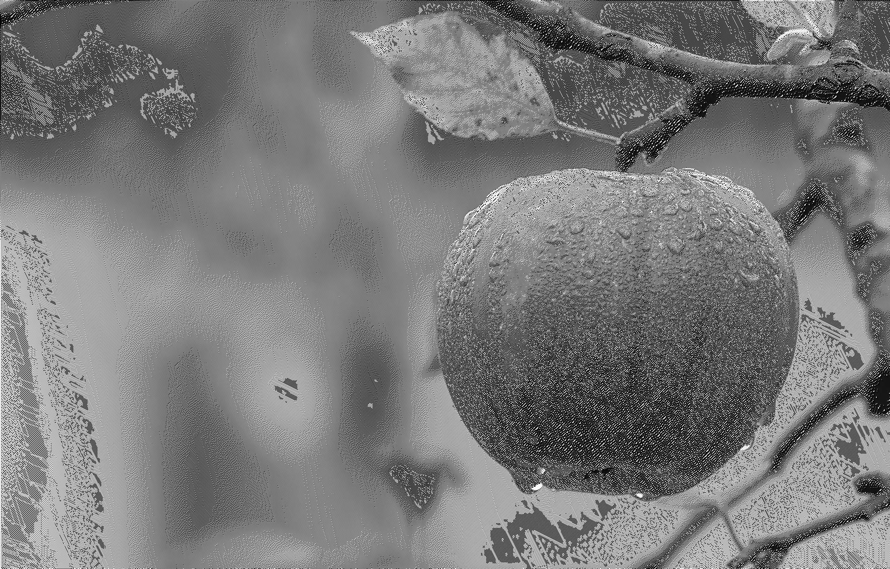

# floyd_steinberg_dithering
HHome work for Image Proccesing, includes nearest-neighbor interpolation, histogram equalization and floyd_steinberg_dithering. The methods are not effective in terms of computation, but are more used as representation of algorithms.

</img>
</img>
